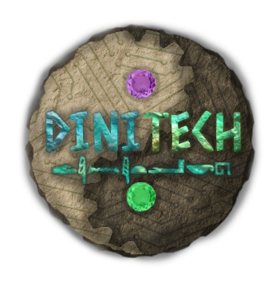

  

## This is the **Gornetix** software repository of team **Dinitech** #25042 from 🇫🇷 - [FTC DECODE](https://teamcenter.robotiquefirstfrance.org/decode/) (2025-2026)

We are team **Dinitech** from **Amédée Gordini High School** (Annecy, France). We are participating in the **Top Fab competition**, a international digital design and manufacturing challenge. 🗿 Passionate about innovation and prototyping, we apply our 3D and engineering skills to a concrete and ambitious project. 👊 Our goal: to showcase the excellence and expertise of the vocational track.

---

### 🚀 Tech Stack
Our software architecture is built on top of FTC libraries to ensure high performance and precision:
*   🏗️ **[FTCLib](https://ftclib.org/)**: A powerful wrapper for more efficient robot control.
*   🏎️ **[Road Runner](https://rr.brott.dev/)**: Advanced motion profiling and autonomous pathing.
*   📊 **[FTC Dashboard](https://github.com/acmerobotics/FTC-Dashboard)**: Real-time telemetry and parameter tuning.
*   🎨 **[MeepMeep](https://github.com/noahbres/MeepMeep)**: Intuitive autonomous trajectory visualization.

---

### 📱 Connect with Us
Stay updated with our progress, matches, and reveals:
*   🎥 **YouTube**: [Dinitech Channel](https://www.youtube.com/channel/UCaTOewE9eect9wCToUA1e8g)
*   📸 **Instagram**: [@dinitech.first](https://www.instagram.com/dinitech.first/)
*   🏫 **High School**: [Lycée Professionnel Amédée Gordini](https://amedee-gordini.ent.auvergnerhonealpes.fr/)

---

### Our mentor : [Quadra](https://www.quadra-concrete.com/)
**Quadra** is a French manufacturer specializing in the design and production of turnkey production units for the concrete industry, including vibrating presses, automated lines, and robotic solutions for producing concrete blocks, pavers, slabs, and curbs.
The company integrates advanced technologies, automated processes, and high-performance vibration systems to optimize production and meet industrial needs worldwide.
It delivers complete installations sold and commissioned internationally, with an in-house engineering office for mechanical, electrical, robotic, and automation design.
